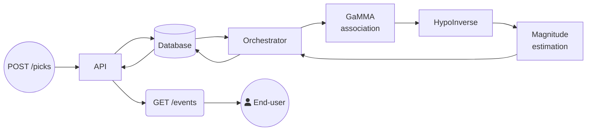

# TF2AsLoc

**TRANSFORM² Associator-Locator** - a near real-time seismic phase association and event location service.

The TRANSFORM² Associator-Locator (TF2AsLoc) accepts seismic phase picks over a REST API, associates them into events, locates the events, computes magnitudes, and serves the results as QuakeML.

## Pipeline overview

1. **Ingestion** - picks (e.g. from [nrt-dl-picker](https://github.com/TODO-ORG/nrt-dl-picker)) are posted to the API and stored in PostgreSQL.
2. **Association** - the orchestrator periodically scans a sliding time window of recent picks and runs the [GaMMA](https://github.com/AI4EPS/GaMMA) associator, which produces candidate events with preliminary origins.
3. **Filtering** - events outside the configured region of interest are discarded; the rest are reconciled with previously located events.
4. **Location** - [USGS HypoInverse](https://www.usgs.gov/software/hypoinverse-earthquake-location) computes the final hypocenter.
5. **Magnitude** - waveforms are fetched from FDSN web services, instrument responses removed, and local (ML) computed.
6. **Delivery** - located events are served as QuakeML through `GET /events`.

## Where to go next

- [Installation & Requirements](installation.md) - what you need and how to deploy.
- [Quick Start](quickstart.md) - quick example (including demo data).
- [Configuration Reference](configuration.md) - available configurations explained.
- [Metadata Files](metadata.md) - the external input files the service depends on.
- [API Usage](api.md) - endpoints, authentication, and examples.
- [Helper Scripts](scripts.md) - converting, posting, and retrieving data.
- [Demo Walkthrough](demo.md) - run a complete example with provided data.
- [Customizations](customizations.md) - how TF2AsLoc deviates from the stock third-party software.

## Funding

This work is part of the [TRANSFORM²](https://www.transform2-project.eu/) project which aims to improve physical and digital infrastructure across Near-Fault Observatories (NFOs) in Europe.

TRANSFORM² is funded by the European Union under project number 101188365 within the HORIZON-INFRA-2024-DEV-01-01 call.

  

